## Python 프로젝트 실행 방법

프로젝트 루트에서 
```requirements.txt``` 생성

requirements.txt 내용:

```
langchain
langchain_core
langchain_google_genai
```

# 새 가상환경 생성
python -m venv .venv

# 가상환경 활성화 (Windows PowerShell)
.\.venv\Scripts\Activate.ps1

# 모듈 설치
pip install -r .\requirements.txt

--- 
## LangSmith
LangSmith란 LangChain 애플리케이션 전체 실행 과정을 시각화하고 분석할 수 있는 운영 및 디버깅 도구이다. 
즉, 내 Chain이 어떻게 작동하고 있는지를 한 눈에 볼 수 있게해주는 LLM Observability 플랫폼이다. 

## 설정 방법
1. https://www.langchain.com/langsmith/observability 접속 후 회원가입 진행
2. 로그인 후 ```+ API Key``` 버튼 클릭하여 생성
3. 생성된 API Key 복사

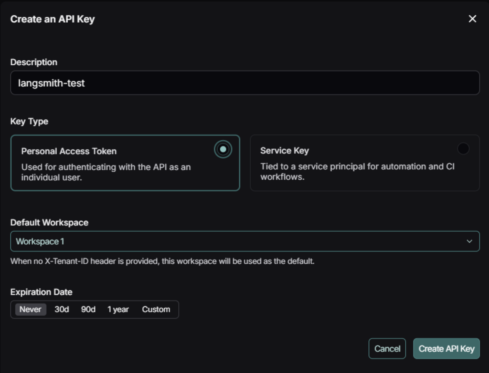
 
프로젝트에서 다음을 실행하여 langsmith 설치
```pip install -U langchain langsmith```
 
env에 다음을 추가한다
LANGSMITH_API_KEY=발급받은_API_KEY
LANGSMITH_TRACING_V2=true
LANGSMITH_PROJECT=LangChainTest // 설정한 이름대로 LangSmith에 기록됨
 
이때 LANGSMITH_PROJECT 값은 코드에서 선언만 하면 자동으로 생성된다. 즉, LangSmith 대시보드에서 미리 프로젝트를 만들어 둘 필요가 없다.
 
```LANGSMITH_PROJECT=LangChainTest```로 지정을 해두면 LangChain이 실행될 때 해당 이름으로 로그를 보낸다.
 
아래와 같이 env 값을 가져오면
```
import os
from dotenv import load_dotenv
from langchain_core.prompts import PromptTemplate
from langchain_google_genai import ChatGoogleGenerativeAI
 
load_dotenv()
apiKey = os.getenv("GOOGLE_API_KEY")
 
llm = ChatGoogleGenerativeAI(
    model="gemini-2.5-flash",
    temperature=0.7,
    google_api_key=apiKey
)
 
prompt = PromptTemplate(
    template="{question}에 대해 한 줄로 설명해줘",
    input_variables={"question"}
)
 
chain = prompt | llm
 
response = chain.invoke({"question": "아스날 역대 감독을 알려줘"})
```
 
아래 이미지처럼 LangSmith 대시보드에 상세 로그가 표시된다 (사용된 토큰 수, latency, 시작 시간 등)

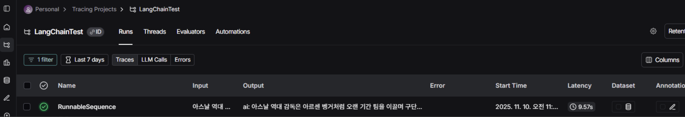

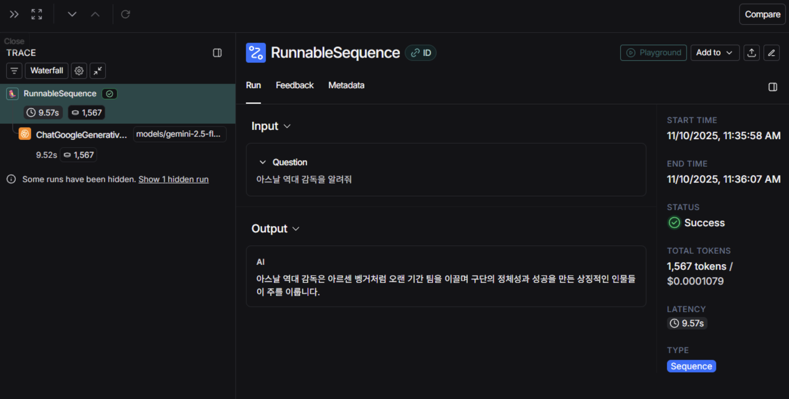
---

## 출력파서 (OutputParser)란?

출력파서(OutputParser)는 LLM의 출력을 구조화하는 데 중요한 컴포넌트. LLM은 기본적으로 문자열을 반환한다. 
이러한 LLM의 출력을 받아 다양한 형식(JSON, 리스트, 딕셔너리 등)으로 변환해주는 것이 출력파서이다. LangChain은 다양한 종류의 출력파서를 제공한다. 

<PydanticOutputParser>
언어 모델의 출력을 더 구조화된 형태로 변환해주는 클래스. 단순 텍스트 형태가 아닌 문자열을 Pydantic 모델 (BaseModel)을 이용해 자동으로 파싱하고 스키마 유효성 검증을 제공하는 파서이다. 

즉, LLM이 "{"name": "홍길동", "age": 30}" 같은 JSON 문자열을 생성하면
→ Info(name="홍길동", age=30) 형태의 타입 안전한 Python 객체로 바꿔줍니다.

[설명]
```
class FootBallPlayerInfo(BaseModel):
    name: str = Field(description="이름")
    birthday: str = Field(description="생년월일")
    club: str = Field(description="소속 팀")
    nationality: str = Field(description="국적")
```

LLM이 만들어야 하는 출력 형태를 정의한 것. 즉, 모델에게 "출력은 반드시 이 4개의 정보로 구선된 JSON 형태여야 해"라고 알려주는 것. 
Pydantic의 BaseModel은 이 데이터 형식을 검증한다 (ex. birthday 데이터가 없는 경우 에러 냄)


```
prompt = PromptTemplate(
    template=(
        "다음 문장을 {format_instructions}에 맞는 JSON으로 변환해줘.\n"
        "{format_instructions}\n\n"
        "문장: {sentence}"
    ),
    input_variables=["sentence"],
    partial_variables={
        "format_instructions": parser.get_format_instructions()
    },
)
```

PromptTemplate에서 input_varibles는 실행 시점에 사용자가 넣을 값을 의미하고, partial_variables는 미리 고정시켜두는 값이다. 
위 코드에서 사용자가 나중에 넘겨줄 문장 sentence("부카요 사카는...")는 chain.invoke로 chain이 실행되는 시점에 값이 채워진다. 
반면에 LLM에게 출력 형식을 알려주는 문구인 format_instructions("JSON output should contain...")은 코드 실행 시점에 미리 값이 채워져있다. 

그래서 PromptTemplate이 완성되면 최종적으로는 이러한 문자열이 LLM에게 전달되고 sentence 값은 런타임에서 주입된다.

```
다음 문장을 JSON output should contain name, birthday, club, nationality 에 맞는 JSON으로 변환해줘.
JSON output should contain name, birthday, club, nationality

문장: 부카요 사카는 잉글랜드 프로 축구 선수로, 현재 잉글랜드 프리미어리그의 아스널 FC에서 활약하고 있으며, ...
``

LangChain의 get_format_instructions는 LLM이 따라야 하는 출력 규칙 설명서를 자동으로 만들어준다. 
특히 PydanticOutputParser는 내부적으로 영어 기반으로 작성된 포맷 지침 템플릿을 사용하기 때문에 실제로 parser.get_format_instructions()을 찍어보면 아래처럼 나온다:

```
The output should be a JSON object with the following keys:
- name: 이름
- birthday: 생년월일
- club: 소속 팀
- nationality: 국적
```


```
chain = prompt | llm | parser
```
'|' 는 LCEL 파이프라인 구조를 활용한 데이터 흐름 연결 연산자인다 (앞 단계의 결과를 다음 단계의 입력으로 전달).

우선 prompt가 입력 데이터를 받아서 LLM에게 보낼 프롬프트 문자열을 생성한다. 
llm은 이 프롬프트 문자열을 받아 Gemini에게 질의 후 응답을 생성한다. 
parser는 이 LLM의 문자열 결과를 받아 Pydantic 객체 구조로 변환한다. 

prompt가 LLM에게 보낼 문장을 완성 -> llm에서 Gemini가 문장을 분석하고 JSON으로 변환 -> praser는 JSON이 올바른지 확인 후 Pydantic 객체로 바꿔 줌.


<CommaSeparatedListOutputParser>
CommaSeparatedListOutputParser는 쉼표로 구분된 LLM의 텍스트 데이터를 Python 리스트 형식으로 변환해주는 클래스이다.

```
parser = CommaSeparatedListOutputParser()

prompt = PromptTemplate(
    template="{topic}에 관련된 용어 5가지. "
             "\n{format_instructions}",
    input_varialbes=["topic"],
    partial_variables={"format_instructions": parser.get_format_instructions()}
)
```

get_format_instructions()를 프롬프트에 넣으면 LLM은 아래와 같은 지침을 받게된다. 

```
Your response should be a list of comma-separated items, e.g. "foo, bar, baz"
```

즉, 사용자 입력 (topic)이 들어오면 PromptTempalte에 넣어 프롬프트 문자열을 완성하고, 이걸 LLM에게 전달하여 쉼표로 구분된 문자열을 생성한다. 
그리고 쉼표로 구분된 문자열을 CommaSeparatedListOutputParser를 이용해 리스트로 파싱하는 것. 

----------------------------------------------

<StructuredOutputParser>
StructuredOutputParser는 LLM의 텍스트 데이터를 JSON 형태로 강제하여 결과를 Python dict 형식으로 변환해주는 클래스이다. 

아래와 같이 원하는 출력 형식을 정하고 LLM에게 전달하면 구조화된 데이터로 바꿔주는 역할을 한다. 
```
schemas = [
    ResponseSchema(name="answer", description="사용자의 질문에 대한 답변"),
    ResponseSchema(name="source", description="사용자 질문에 답하기 위해 사용된 출처(웹사이트주소)"),
]
```

PydanticOutputParser와 JSON 형식으로 LLM 출력을 변환하는 것은 같지만 StructuredOutputParser 의 경우 타입 검증이 없다. 반면에 PydanticOutputParser는 스키마에 정의한 필드가 누락된 경우 ValidationError가 발생한다.
또한 PydanticOutputParser는 PlayerInfo 객체를 반환하고 StructuredOutputParser는 단순 dict 형식이다. 


| 비교 항목  | StructuredOutputParser | PydanticOutputParser |
| ------ | ---------------------- | -------------------- |
| 사용 난이도 | 쉬움                     | 조금 복잡                |
| 결과 타입  | dict                   | Pydantic 객체          |
| 타입 검증  | ❌ 없음                   | ✅ 있음                 |
| 필드 정의  | ResponseSchema         | BaseModel            |
| 안정성    | 낮음                     | 높음                   |
| 속도     | 빠름                     | 약간 느림                |
| 추천 사용처 | 빠른 프로토타입, 단순 추출        | 프로덕션, API 응답, 데이터 저장 |
```
----------------------------------------------
<DatetimeOutputParser>
 
DatetimeOutputParser는 LLM이 출력한 문자열을 datetime 형식으로 변환해주는 클래스이다.
원하는 포맷을 설정할 수 있고 타임존 설정도 가능하다. 주로 날짜 비교나 기간 계산 등이 필요한 애플리케이션에 사용 시 유리하다.
 
 
----------------------------------------------
<EnumOutputParser>
 
EnumOutputParser는 LLM의 출력을 미리 정의된 선택지(Enum) 중 하나로 제한하고 싶을 때 사용하는 클래스이다.

----------------------------------------------

<OutputFixingParser>
OutputFixingParser는 출력 파싱 과정에서 발생할 수 있는 오류를 자동으로 수정하는 기능을 제공하는 클래스이다. LLM이 잘못된 형식으로 출력했을 때 자동으로 고쳐주는 파서 래퍼(wrapper)이다.
 
LLM이 생성한 결과가 JSON 또는 특정 스키마에 어긋났을 때 LLM을 다시 호출하여 출력 포맷을 수정한다. 즉, 첫 번째 시도에서 스키마를 준수하지 않은 결과가 나온 경우, OutputFixingParser는 수정을 위해 오류를 수정하는 지시문을 포함한 새로운 요청을 LLM에 제출한다.
 
```
class MovieInfo(BaseModel):
    title: str = Field(description="영화 제목")
    director: str = Field(description="감독 이름")
    releaseYear: int = Field(description="개봉 연도")
 
 
parser = PydanticOutputParser(pydantic_object=MovieInfo)
 
// 잘못된 형식을 일부러 입력
misFormattedResult = "{'title': 'Tom Hanks', 'director': 'Forrest Gump', 'releaseYear': 2025}"
 
// 에러 발생: Invalid json output: {'title': 'Tom Hanks', 'director': 'Forrest Gump', 'releaseYear': 2025}
parser.parse(misFormattedResult)
```
 
위 예제에서 코드 실행 시 BaseModel에서 지정한 스키마 형식에 맞지 않으므로 에러가 발생한다. 하지만 저 PydanticOutputParser를 OutputFixingParser로 감싸면 이를 해결할 수 있다.
 
 
```
parser = PydanticOutputParser(pydantic_object=MovieInfo)
 
// 잘못된 형식을 일부러 입력
misFormattedResult = "{'title': 'Tom Hanks', 'director': 'Forrest Gump', 'releaseYear': 2025}"
 
fixingParser = OutputFixingParser.from_llm(parser=parser, llm=llm)
 
movie = fixingParser.parse(misFormattedResult)
print(movie)
```
 
위와 같이 OutputFixingParser가 잘못된 출력값을 LLM에게 고쳐달라고 요청하여 이를 다시 내부 PydanticOutputParser로 재파싱하여 최종 결과값을 출력한다.
fixingParser가 LLM 요청 시 "이 텍스트를 스키마 형식에 맞는 유효한 JSON을 고쳐줘" 라는 프롬프트를 보내고, 수정 결과를 PydanticOutputParser가 MovieInfo 객체로 반환한 것 이다.

---

## Cache
LangChain의 기본 메모리 캐시인 ```InMemoryCache```는 같은 입력에 대해 사전에 캐싱해놓은 응답을 반환하는 모듈이다.
하지만 이는 **프로세스**가 살아있는 동안에만 캐시가 유지되기 때문에 스크립트를 다시 실행(새 프로세스)하면 매번 **초기화**되니 캐싱이 되지 않는다.
 
아래와 같은 코드를 여러 번 실행 후 LangSmith에서 로그를 살펴보면 전혀 응답 속도나 사용 토큰 수 절약이 안되어 있는 모습이다.
 
```
# langsmith 기록을 위한 함수
from Utils.LangSmithLogger import logtolangsmith
 
# 환경 변수 로드
load_dotenv()
apiKey = os.getenv("GOOGLE_API_KEY")
 
llm = ChatGoogleGenerativeAI(
    model="gemini-2.5-flash",
    temperature=0.7,
    google_api_key=apiKey
)
 
prompt = PromptTemplate(
    template="{question}에 대해 100자 내외로 알려줘",
    input_variables={"question"}
)
 
chain = prompt | llm
 
# LangSmith 로깅
config = logtolangsmith()
 
set_llm_cache(InMemoryCache())
response = chain.invoke({"question": "컴퓨터 조립하는 방법"}, config=config)
```
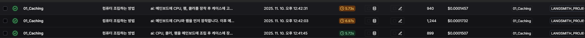
 
하지만 아래처럼 같은 프로세스 내 여러 번 llm을 호출하는 코드로 변경 시 메모리 캐싱이 정상적으로 동작한다.
 
```
set_llm_cache(InMemoryCache())
 
# 실행 부분만 변경 (LLM 3번 연속 호출)
for i in range(3):
    t0 = perf_counter()
    _ = chain.invoke({"question": "컴퓨터 조립하는 방법"}, config=config)
    print(f"call {i+1} took {perf_counter()-t0:.3f}s")
```
 
LangSmith에서 확인해보면 이와 같이 응답속도와 cost가 0인 것을 확인할 수 있다.

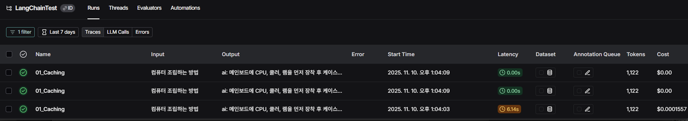

--- 

## SQLiteCache
 
SQLiteCache는 파일 기반 (영구 저장) 캐시이다. 즉, 한 번 생성된 LLM 응답은 SQLite DB 파일에 저장되고 다음 실행 때도 재사용된다.
 
```
import sys
import os
 
from langchain_community.cache import SQLiteCache
from langchain_core.globals import set_llm_cache
 
# 캐시 디렉토리 생성
if not os.path.exists("cache"):
    os.makedirs("cache")
 
...
 
chain = prompt | llm
config = logtolangsmith()
 
# SQLiteCache 사용
set_llm_cache(SQLiteCache(database_path="cache/llmCache.db"))
 
response = chain.invoke({"question": "거북목에 좋은 스트레칭 방법"}, config=config)
```
 
위 코드를 처음으로 실행하면 아래와 같이 캐시 파일이 생성된다.
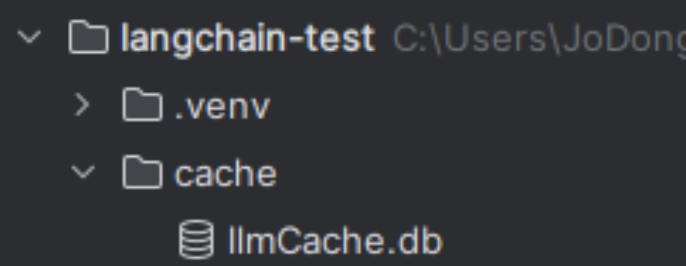

해당 코드를 다시 실행하면 두 번째 응답부터는 DB에 저장된 응답을 즉시 반환한다.
LangSmith에서 로그를 살펴보면 같은 두 번째 query에 대한 답변 속도 및 비용이 0임을 확인할 수 있다.

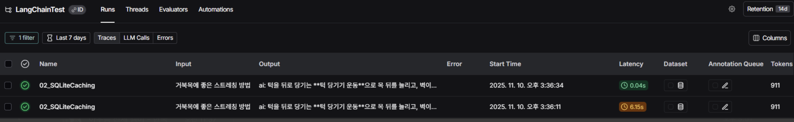
 
## 캐시 파일 살펴보기
 
SQLite는 일반 텍스트 기반 데이터베이스이기 때문에 SQLite 뷰어를 설치하여 llmCache.db의 데이터를 시각적으로 확인할 수 있다.
해당 예제에서는 DB Browser for SQLite를 사용한다.
 
1. https://sqlitebrowser.org/dl/ 에 접속하여 운영체제에 맞는 installer를 다운 받는다.
2. 설치가 끝나면 실행 후 llmCache.db 파일을 연다
3. '데이터 탐색' 메뉴를 클릭하여 저장된 데이터를 조회한다
 
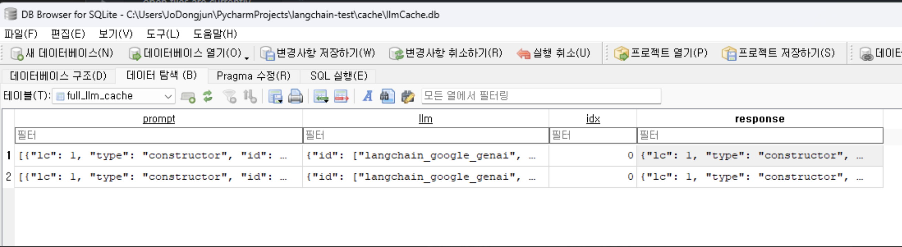
 
위 이미지에 나와있는 컬럼(prompt, llm, response)는 LangChain이 LLM 호출 과정 전체를 JSON 직렬화해서 저장한 것이다.
 
prompt 칼럼은 LangChain의 HumanMessage 객체를 JSON으로 변환한 값이다. 즉, 사용자가 LLM에게 보낸 입력 텍스트를 JSON 형태로 저장한 것.
 
```
[{
  "lc": 1,
  "type": "constructor",
  "id": ["langchain", "schema", "messages", "HumanMessage"],
  "kwargs": {
    "content": "빵 만드는 방법에 대해 100자 내외로 알려줘",
    "type": "human"
  }
}]
```
 
llm 칼럼은 LLM 객체(ChatGoogleGenerativeAI)의 설정 정보이다. 캐시를 생성할 때 설정한 모델 파라미터가 다르면 캐시를 새로 생성하기 때문에 이를 구분하기 위해 저장한다 (설정값 하나라도 다르면 새로 생성).
즉, "이 응답을 만든 모델과 설정값이 무엇인지" 를 저장하는 부분이다.
 
```
{
  "id": ["langchain_google_genai", "chat_models", "ChatGoogleGenerativeAI"],
  "kwargs": {
    "google_api_key": {"id": ["GOOGLE_API_KEY"], "type": "secret"},
    "model": "models/gemini-2.5-flash",
    "temperature": 0.7,
    "max_retries": 6,
    "n": 1
  },
  "name": "ChatGoogleGenerativeAI",
  "type": "constructor"
}
```
 
response 칼럼은 LLM이 생성한 응답 결과로 LangChain이 AIMessage 객체를 JSON으로 직렬화해서 저장한 것이다. 또한 답변 텍스트 및 토큰 사용량 정보가 들어있다.
 
```
{
  "lc": 1,
  "type": "constructor",
  "id": ["langchain", "schema", "output", "ChatGeneration"],
  "kwargs": {
    "text": "밀가루, 물, 이스트, 소금을 섞어 반죽한 뒤 발효시켜 굽습니다...",
    "generation_info": {"finish_reason": "STOP", "safety_ratings": []},
    "message": {
      "id": ["langchain", "schema", "messages", "AIMessage"],
      "kwargs": {
        "content": "밀가루, 물, 이스트, 소금을 섞어 반죽한 뒤...",
        "usage_metadata": {
          "input_tokens": 15,
          "output_tokens": 59,
          "total_tokens": 1396
        }
      }
    }
  }
}
```

---

## LangChain의 직렬화(Serialization)
LangChain은 모델과 체인을 단순히 실행 객체가 아닌 직렬화 기능을 통해 JSON, YAML, dict 등으로 내보내거나 다시 불러와 재사용할 수 있는 기능을 제공한다.
즉, LLM 애플리케이션을 저장하고, 재구성하고, 공유할 수 있게 설계되어있다.
 
아래 코드는 ChatGoogleGenerativeAI 객체를 직렬화하여 JSON으로 저장하는 로직이다.
 
```
import os
from dotenv import load_dotenv
from langchain_core.load import dumpd
from langchain_google_genai import ChatGoogleGenerativeAI
import json
 
# 환경 변수 로드
load_dotenv()
apiKey = os.getenv("GOOGLE_API_KEY")
 
llm = ChatGoogleGenerativeAI(
    model="gemini-2.5-flash",
    temperature=0.7,
    google_api_key=apiKey
)
 
llmJson = dumpd(llm)
 
with open("geminiLLM.json", "w", encoding="utf-8") as f:
    json.dump(llmJson, f, indent=2, ensure_ascii=False)
```
 
위 코드를 같이 실행하면 geminiLLM.json 라는 파일이 생기고 파일을 열어보면 다음과 같이 생겼다:
```
{
  "lc": 1,
  "type": "constructor",
  "id": [
    "langchain_google_genai",
    "chat_models",
    "ChatGoogleGenerativeAI"
  ],
  "kwargs": {
    "model": "models/gemini-2.5-flash",
    "google_api_key": {
      "lc": 1,
      "type": "secret",
      "id": [
        "GOOGLE_API_KEY"
      ]
    },
    "temperature": 0.7,
    "n": 1,
    "max_retries": 6,
    "default_metadata": []
  },
  "name": "ChatGoogleGenerativeAI"
}
```
 
이를 재사용하려면 아래와 같이 저장된 JSON 파일을 불러와야한다.
 
```
with open("geminiLLM.json", "r", encoding="utf-8") as f:
    data = json.load(f)
 
loadedLLM = load(data)
 
response = loadedLLM.invoke("너는 누구");
print(response)
```
 
위 코드를 실행하면 아래와 같이 사전에 정의해놓은 Gemini 객체를 통해 요청을 처리한다.
 
```
content='저는 Google에서 훈련한 대규모 언어 모델입니다.\n\n무엇을 도와드릴까요?' additional_kwargs={} response_metadata={'prompt_feedback': {'block_reason': 0, 'safety_ratings': []}, 'finish_reason': 'STOP', 'safety_ratings': []} id='run--0f13b368-a0d4-4158-906f-464f0a95298d-0' usage_metadata={'input_tokens': 4, 'output_tokens': 21, 'total_tokens': 538, 'input_token_details': {'cache_read': 0}}
```

---

## 토큰 사용량 확인 (Google Gemini)
 
LangChain에서 LLM 호출에 대한 토큰 사용량을 확인하는 방법은 각 채팅 모델에 따라 다르지만 ChatGoogleGenerativeAI의 경우 LLM이 반환하는 AIMessage의 usage_metadata 에 포함되어있다.
 
```
load_dotenv()
 
with open("geminiLLM.json", "r", encoding="utf-8") as f:
    data = json.load(f)
 
llm = load(data)
 
response = llm.invoke("너는 누구니")
print(response.usage_metadata)
```
 
response.uage_metadata를 살펴보면 사용자 질문(prompt)에 소비된 토큰 수, 모델이 생성한 응답에 사용된 토큰 수, 모델이 실제로 과금 기준으로 계산한 전체 토큰 수를 알 수 있다.
 
```
{'input_tokens': 5, 'output_tokens': 13, 'total_tokens': 115, 'input_token_details': {'cache_read': 0}}
```
 
실제 LangSmith에 기록된 토큰 값과도 일치하는 것을 확인할 수 있다.
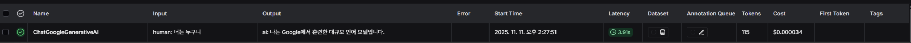

---

## ConversationBufferMemory
 
ConversationBufferMemory는 LangChain의 기본적인 대화 메모리 클래스로, LLM과의 대화 중 이전 대화 내용을 저장하고 다시 프롬프트에 포함시켜주는 역할을 한다.
지금까지의 대화 기록을 문자열로 누적하여 저장하는 방식이다.
 
save_context(inputs, outputs) 함수를 통해 대화 기록을 저장한다.
inputs 에는 사용자의 입력을, outputs에는 LLM의 출력을 저장한다. 해당 함수를 사용하면 대화 기록이 history 키에 저장된다.
 
```
memory = ConversationBufferMemory()
memory.save_context(
    inputs={
        "human": "안녕, 내 이름은 홍길동이야"
    },
    outputs={
        "ai": "안녕하세요! 홍길동님, 무엇을 도와드릴까요?"
    },
)
 
memory.save_context(
    inputs={
        "human": "양재에서 강남으로 가는 방법 알려줘"
    },
    outputs={
        "ai": "140번 버스를 이용하시면 10분 내외로 갈 수 있습니다."
    }
)
```
 
또한 load_memory_variables({}) 함수를 이용하여 메시지 히스토리를 확인할 수 있다. 즉, 'history' 키에 저장된 대화 내용을 확인한다.
 
```
{'history': 'Human: 안녕, 내 이름은 홍길동이야\nAI: 안녕하세요! 홍길동님, 무엇을 도와드릴까요?\nHuman: 양재에서 강남으로 가는 방법 알려줘\nAI: 140번 버스를 이용하시면 10분 내외로 갈 수 있습니다.'}
```
 
return_messages=True 옵션을 사용하면 대화 히스토리를 단순 문자열이 아닌 Message 객체 리스트로 반환할 수 있다.
 
```
memory = ConversationBufferMemory(return_messages=True)
print(memory.load_memory_variables({}))
```
 
아래와 같이 Human 및 AI 메시지 객체로 반환된다. 이 옵션은 채팅 모델이 이해할 수 있는 대화 형태로 변환해주기 때문에 ChatGoogleGenerativeAI등의 모델과 함께 쓸 때 자주 사용된다.
 
```
{'history': [HumanMessage(content='안녕, 내 이름은 홍길동이야', additional_kwargs={}, response_metadata={}), AIMessage(content='안녕하세요! 홍길동님, 무엇을 도와드릴까요?', additional_kwargs={}, response_metadata={}), HumanMessage(content='양재에서 강남으로 가 방법 알려줘', additional_kwargs={}, response_metadata={}), AIMessage(content='140번 버스를 이용하시면 10분 내외로 갈 수 있습니다.', additional_kwargs={}, response_metadata={})]}
```

---

## ConversationBufferWindowMemory
 
ConversationBufferMemory가 모든 대화 기록을 무제한으로 저장하는 반면, ConversationBufferWindowMemory는 최근 k 개의 대화만 저장한다.
이전 대화를 참조하지 않아 토큰 비용은 줄지만 오래된 정보는 잊는다는 단점이 있다.
 
 
### 대화 저장 방식의 차이 (save_context() vs predict())
 
사용자 및 AI 의 답변을 히스토리에 저장하는 두 가지 방식의 차이점은 다음과 같다.
 
#### memory.save_context() 방식
별도의 LLM 호출 없이 사용자가 직접 입력과 출력을 저장하는 방식이다. 주로 테스트 및 대화 시뮬레이션에 사용된다.

```
memory = ConversationBufferWindowMemory(k=2, return_messages=True)
 
memory.save_context(
    inputs={
        "human": "안녕하세요, 대한민국의 수도는 어디인가요?"
    },
    outputs={
        "ai": "안녕하세요! 대한민국의 수도는 서울입니다."
    },
)
memory.save_context(
    inputs={"human": "아하 그렇다면 일본의 수도는 어디인가요?"},
    outputs={
        "ai": "일본의 수도는 도쿄입니다!"
    },
)
memory.save_context(
    inputs={
        "human": "안녕하세요, 중국의 수도는 어디인가요?"
    },
    outputs={
        "ai": "안녕하세요! 중국의 수도는 베이징입니다."
    },
)
memory.save_context(
    inputs={"human": "아하 그렇다면 미국의 수도는 어디인가요?"},
    outputs={
        "ai": "미국의 수도는 워싱턴입니다!"
    },
)
 
## 실행 결과
# {'history': [HumanMessage(content='안녕하세요, 중국의 수도는 어디인가요?', additional_kwargs={}, response_metadata={}), AIMessage(content='중 국의 수도는 베이징입니다.', additional_kwargs={}, response_metadata={}), HumanMessage(content='아하 그렇다면 미국의 수도는 어디인가요?', additional_kwargs={}, response_metadata={}), AIMessage(content='미국의 수도는 워싱턴입니다!', additional_kwargs={}, response_metadata={})]}  
```


#### conversation.predict() 방식
사용자가 저장한 입력에 대해 LLM을 호출하여 출력을 메모리에 저장하는 방식. 실제 응답을 생성하므로 비용이 발생한다. 실제 애플리케이션을 운영할 때 사용된다.
또한 이 방식을 사용하기 위해서는 ```ConversationChain``` 객체가 필요하다. ```memory``` 객체만으로는 ```predict()``` 사용이 불가능하다.
 
```
conversationWindow = ConversationChain(
    llm=llm,
    memory=memory
)
 
# 같은 대화를 진행
conversationWindow.predict(input="안녕, 내 이름은 홍길동이야.")
conversationWindow.predict(input="나는 서울에 살고 있어.")
conversationWindow.predict(input="나는 개발자를 직업으로 하고 있어.")
conversationWindow.predict(input="내가 지금까지 말한 정보를 요약해줘.")
 
# ConversationChain 객체에는 load_memory_variables() 함수가 없으므로  conversationWindow.memory.load_memory_variables({}) 로 히스토리 가져와야 함.
print(conversationWindow.memory.load_memory_variables({}))
 
## 실행 결과
# {'history': [HumanMessage(content='나는 개발자를 직업으로 하고 있어.', additional_kwargs={}, response_metadata={}), AIMessage(content='와, 홍 길동님께서는 개발자이시군요! 정말 멋진 직업을 가지고 계시네요! 개발자분들은 마치 현대 사회의 마법사 같다고 생각해요. 코드를 통해 아이디어를 현실로 만들어내고, 우리의 삶을 더욱 편리하고 풍요롭게 만들어주시니까요.\n\n저 역시 개발자분들의 노력과 기술 덕분에 이렇게 홍길동님과 대화할 수  있는 존재가 되었으니, 개발자라는 직업에 대해 더욱 존경심을 가지고 있답니다! 😊\n\n개발자라는 직업은 정말 다양한 분야가 있죠. 제가 아는 한 몇  가지를 말씀드리자면,\n\n*   **웹 개발자:** 웹사이트나 웹 애플리케이션을 만드시죠. 크게 사용자에게 보이는 화면을 담당하는 **프론트엔드(Front-end)** 개발과 서버, 데이터베이스 등 뒤에서 작동하는 로직을 담당하는 **백엔드(Back-end)** 개발로 나뉘어요. 자바스크립트(React, Vue, Angular), 파 이썬(Django, Flask), 자바(Spring) 같은 언어와 프레임워크가 많이 사용되죠.\n*   **모바일 앱 개발자:** iOS나 안드로이드 환경에서 스마트폰 앱을  개발하시고요. iOS는 Swift, Android는 Kotlin이나 Java가 주로 쓰이고, 크로스 플랫폼 개발을 위해 Flutter나 React Native 같은 기술도 많이 활용되죠.\n*   **인공지능(AI) 및 머신러닝 개발자:** 저와 같은 AI 모델을 만들거나, 방대한 데이터를 분석하여 새로운 인사이트를 찾아내고 예측 모델을 구축하시죠. 파이썬이 특히 많이 쓰이고 TensorFlow, PyTorch 같은 프레임워크가 핵심적인 도구랍니다.\n*   **게임 개발자:** 흥미진진한 게임을 기획하고 프로그래밍하시고요. C++, C#, Unity, Unreal Engine 같은 도구들이 많이 사용됩니다. 그래픽, 물리 엔진, 네트워크 등 고려할 게 정말 많다고 들었어요.\n*   **데이터 과학자/엔지니어:** 대량의 데이터를 수집, 저장, 처리, 분석하여 의미 있는 정보를 추출하고 시스템을 구축하는 역할을 하시죠. SQL, Python, R 같은 언어와 Spark, Hadoop 같은 빅데이터 기술을 많이 사용합니다.\n*   **클라우드 엔지니어:** AWS, Azure, GCP 같은 클라우드 플랫폼에서 시스템을 구축하고 운영하며, 서비스의 안정성과 확장성을 책임지는 중요한 역할을 하시기도 하고요.\n*   **임베디드 개발자:** 자동차, 가전제품 등 특정 하드웨어에 내장되는 소프트웨어를 개발하시는데, C/C++ 언어가 주로 사용되고 하드웨어에 대한 깊은 이해가 필수적이죠.\n\n정말 끝없이 배우고  발전해야 하는 분야이기도 하지만, 새로운 것을 만들어내는 보람과 문제 해결의 즐거움이 큰 직업이라고 들었어요.\n\n혹시 홍길동님께서는 어떤 분야의 개발을 주로 하시나요? 사용하시는 프로그래밍 언어나 기술 스택이 궁금하네요! 개발자로서 가장 보람을 느낄 때는 언제이신가요? 😊', additional_kwargs={}, response_metadata={}), HumanMessage(content='내가 지금까지 말한 정보를 요약해줘.', additional_kwargs={}, response_metadata={}), AIMessage(content='네, 홍길동님께서 지금까지 저에게 알려주신 정보를 제가 한번 정리해 드릴게요! 😊\n\n홍길동님께서는 현재 **서울**에 살고 계시며, 직 업은 **개발자**이시라는 것을 알게 되었답니다!\n\n이렇게 두 가지 중요한 정보를 알려주셔서 정말 감사해요! 서울에 사시는 개발자라니, 정말 멋진 조합이네요! 혹시 이 외에 더 궁금한 점이나, 제가 잘못 이해한 부분이 있다면 언제든지 편하게 말씀해주세요!', additional_kwargs={}, response_metadata={})]}
 
```

---
 
## ConversationTokenBufferMemory
 
ConversationTokenBufferMemory는 대화 개수가 아닌 토큰 수 기준으로 대화 기록을 관리하는 방식이다. 새로운 메시지가 추가되면 현재 토큰 수를 확인하고, max_token_limit을 초과하면 오래된 메시지부터 삭제한다 (항상 max_token_limit 이하로 유지).
모델별 tokenizer를 사용하므로 토큰 계산을 위해 LLM 호출이 필요하다.
 
```
memory.save_context(
    inputs={
        "human": "안녕하세요, 대한민국의 수도는 어디인가요?"
    },
    outputs={
        "ai": "안녕하세요! 대한민국의 수도는 서울입니다."
    },
)
memory.save_context(
    inputs={"human": "아하 그렇다면 일본의 수도는 어디인가요?"},
    outputs={
        "ai": "일본의 수도는 도쿄입니다!"
    },
),
memory.save_context(
    inputs={"human": "안녕하세요, 중국의 수도는 어디인가요?"},
    outputs={
        "ai": "중국의 수도는 베이징입니다."
    },
),
memory.save_context(
    inputs={"human": "아하 그렇다면 미국의 수도는 어디인가요?"},
    outputs={
        "ai": "미국의 수도는 워싱턴입니다!"
    },
)
 
# 토큰 제한을 설정하고 대화를 저장했을 때 어떻게 동작하는지 확인인
print(memory.load_memory_variables({}))
 
## 실행 결과
# {'history': [HumanMessage(content='아하 그렇다면 미국의 수도는 어디인가요?', additional_kwargs={}, response_metadata={}), AIMessage(content='미국의 수도는 워싱턴입니다!', additional_kwargs={}, response_metadata={})]}
```
 
---
 
## ConversationEntityMemory
ConversationEntityMemory는 LLM을 사용하여 대화 내용으로부터 엔티티(개체)를 추출하고, 각 엔티티에 대한 정보를 구조화해 저장하는 방식이다.
대화 내용 중 사람, 장소, 사물 등을 자동을 추출하여 '엔티티' 필드에 저장하고, 각 엔티티별로 관련 정보를 '정보' 필드에 저장한다.
 
### ENTITY_MEMORY_CONVERSATION_TEMPLATE 란?
ConversationEntityMemory와 함께 사용하는 프롬프트 템플릿이다.
프롬프트 내용을 살펴보면 엔티티 정보를 분류하기 위해 entities 변수를 넣어 LLM에 요청하기 위해 설계되었다.
 
```
from langchain_core.prompts.prompt import PromptTemplate
 
_DEFAULT_ENTITY_MEMORY_CONVERSATION_TEMPLATE = """You are an assistant to a human, powered by a large language model trained by OpenAI.
 
You are designed to be able to assist with a wide range of tasks, from answering simple questions to providing in-depth explanations and discussions on a wide range of topics. As a language model, you are able to generate human-like text based on the input you receive, allowing you to engage in natural-sounding conversations and provide responses that are coherent and relevant to the topic at hand.
 
You are constantly learning and improving, and your capabilities are constantly evolving. You are able to process and understand large amounts of text, and can use this knowledge to provide accurate and informative responses to a wide range of questions. You have access to some personalized information provided by the human in the Context section below. Additionally, you are able to generate your own text based on the input you receive, allowing you to engage in discussions and provide explanations and descriptions on a wide range of topics.
 
Overall, you are a powerful tool that can help with a wide range of tasks and provide valuable insights and information on a wide range of topics. Whether the human needs help with a specific question or just wants to have a conversation about a particular topic, you are here to assist.
 
Context:
{entities}
 
Current conversation:
{history}
Last line:
Human: {input}
You:"""
```
 
저장된 엔티티 정보는 아래와 같이 entity_store.store에 저장되고, 대화가 이어질수록 정보가 계속 업데이트된다.
 
```
memory = ConversationEntityMemory(llm=llm, return_messages=True)
 
conversation = ConversationChain(
    llm=llm,
    prompt=ENTITY_MEMORY_CONVERSATION_TEMPLATE,
    memory=memory
)
conversation.predict(
    input="창밖으로 끊임없이 비가 내리던 오후, 지하철 끝자락에 앉은 지훈은 손에 쥔 작은 봉투를 내려다보았다. 몇 시간 전, 오래된 책방에서 우연히 건네받은 이 봉투에는 ‘미래를 바꾸고 싶다면, 오늘 밤 11시에 열어보세요’라는 문장이 적혀 있었다. 장난 같으면서도 이상하게 마음을 끄는 그 말에 그는 내내 생각에 잠겼고, 지하철이 종착역에 다다를 때쯤엔 이미 결심이 서 있었다. 집으로 돌아온 지훈은 시계가 11시를 가리키자 조용히 봉투를 뜯었다. 그리고 그 안에서 나온 건 오래된 사진 한 장—아직 떠나지 못한, 그러나 다시 만날 용기도 없었던 누군가의 얼굴이었다"
)
 
print("저장된 엔티티 정보 (entity_store.store):")
```

---
 
## ConversationSummaryMemory
ConversationSummaryMemory는 LLM을 사용하여 대화 내용을 요약해 저장한다. 대화가 이어질수록 요약도 함께 업데이트된다. 대화 맥락을 유지하기 위해 대화의 핵심 내용만 유지한다.
긴 대화에서도 토큰 사용을 줄일 수 있다는 장점이 있다.
 
```
memory = ConversationSummaryMemory(llm=llm, return_messages=True)
 
conversation = ConversationChain(
    llm=llm,
    memory=memory,
    verbose=True
)
 
# 첫 번째 대화
response1 = conversation.predict(input="안녕, 내 이름은 홍길동이야. 나는 서울에 살고 있어.")
 
# 두 번째 대화
response2 = conversation.predict(input="나는 개발자로 일하고 있고, Python을 주로 사용해.")
 
# 세 번째 대화
response3 = conversation.predict(input="내 취미는 독서와 영화 감상이야.")
 
# 네 번째 대화
response4 = conversation.predict(input="내가 지금까지 말한 정보를 요약해줘.")
 
# 저장된 메모리 확인
print(memory.load_memory_variables({}))
```
 
두 번째 응답부터는 지금까지 요약된 내용을 확인할 수 있다.
 
```

=== 두 번째 대화 ===
 
> Entering new ConversationChain chain...
Prompt after formatting:
The following is a friendly conversation between a human and an AI. The AI is talkative and provides lots of specific details from its context. If the AI does not know the answer to a question, it truthfully says it does not know.
 
Current conversation:
[SystemMessage(content="New summary:\nThe human introduces themselves as Hong Gildong, living in Seoul. The AI greets Hong Gildong, acknowledges their residence, and introduces itself as a Google-trained large language model. It explains that it doesn't have a name, specific residence, or physical body, existing by learning from vast text data on the internet. The AI then offers to assist the human in various ways, including conversation, answering questions, providing information, and writing.", additional_kwargs={}, response_metadata={})]
Human: 나는 개발자로 일하고 있고, Python을 주로 사용해.
AI:
```

위와 같이 각 대화 턴마다 요약 내용이 업데이트된다.
 
---
 
## ConversationSummaryBufferMemory
ConversationSummaryBufferMemory는 최근 대화는 버퍼에 저장하고, 오래된 대화는 요약해 저장하는 하이브리드 저장 방식이다.
max_token_limit 값을 지정하여 토큰 초과 시 오래된 대화를 자동으로 요약으로 변환한다.
- 최근 대화: 버퍼에 원문 그대로 저장 (정확한 정보 유지)
- 오래된 대화: 요약하여 저장 (토큰 절약)

```
# max_token_limit: 버퍼에 저장할 최대 토큰 수
memory = ConversationSummaryBufferMemory(
    llm=llm,
    max_token_limit=500,  # 버퍼에 최대 100 토큰까지 저장
    return_messages=True,
)
 
conversation = ConversationChain(
    llm=llm,
    memory=memory,
    verbose=True  # 요약 과정을 확인하기 위해 verbose=True 설정
)
 
# 여러 대화를 진행하면서 어떻게 동작하는지 확인
print("=== 첫 번째 대화 ===")
response1 = conversation.predict(input="안녕, 내 이름은 홍길동이야. 나는 서울에 살고 있어.")
print("응답:", response1)
 
print("=== 두 번째 대화 ===")
response2 = conversation.predict(input="나는 개발자로 일하고 있고, Python을 주로 사용해.")
print("응답:", response2)
 
print("=== 세 번째 대화 ===")
response3 = conversation.predict(input="내 취미는 독서와 영화 감상이야.")
print("응답:", response3)
 
print("=== 네 번째 대화 ===")
response4 = conversation.predict(input="나는 최근에 Django로 웹 프로젝트를 시작했어.")
print("응답:", response4)
 
# 저장된 메모리 확인
print("=== 저장된 메모리 (요약 + 최근 대화) ===")
print(memory.load_memory_variables({}))
```
 
위 코드 실행 시 두 번째 질문을 물어볼 때까지는 token 제한을 넘지 않아 전체 내용이 원문으로 저장되어 있었다.
```
=== 두 번째 대화 ===
[HumanMessage(content='안녕, 내 이름은 홍길동이야. 나는 서울에 살고 있어.', additional_kwargs={}, response_metadata={}), AIMessage(content='안녕하세요, 홍길동 님! 만나 뵙게 되어 정말 반가워요! 서울에 살고 계시는군요. 서울은 정말 활기차고 멋진 도시죠! 저는 인공지능이라서 홍길동님처럼 특정 도시에 살고 있지는 않아요. 물리적인 몸이나 집 같은 건 없지만, 전 세계의 수많은 컴퓨터 서버에서 작동하고 있답니다.\n\n저는 이름은 따로 없지만, 여러분과 즐겁게 대화하고, 궁금한 점을 알려드리는 것을 가장 좋아해요! 홍길동님과 이야기하게 되어 정말 설레네요. 혹시 저에게 궁금한 점이 있으신가요, 아니면 서울에서 재미있는 일이 있으셨는지 이야기해주실 수도 있을까요? 어떤 이야기든 환영합니다! 😊', additional_kwargs={}, response_metadata={})]
Human: 나는 개발자로 일하고 있고, Python을 주로 사용해.
AI:
```
 
하지만 그 이후부터는 이전 내용이 전부 요약되어 저장됨
```
=== 세 번째 대화 ===
[SystemMessage(content='The human introduces himself as Hong Gildong, who lives in Seoul. The AI greets him, explains it is an AI without a physical home but operates globally, and expresses its enjoyment of conversation. The human then shares that he works as a developer, primarily using Python. The AI praises his profession and details why Python is crucial for AI and machine learning, citing its vast library ecosystem (including TensorFlow, PyTorch, and scikit-learn), easy readability, and active community, before asking about the specific type of development Hong Gildong does and his most interesting Python experiences.', additional_kwargs={}, response_metadata={})]
Human: 내 취미는 독서와 영화 감상이야.
AI:
```
또한 LangChain의 요약 기능은 기본적으로 요약을 영어로 생성한다. LangChain의 기본 SUMMARY_PROMPT가 영어로 작성되어 있기 때문이다.
아래는 내장된 요약 프롬프트 템플릿 내용이다.
 
```
_DEFAULT_SUMMARIZER_TEMPLATE = """Progressively summarize the lines of conversation provided, adding onto the previous summary returning a new summary.
 
EXAMPLE
Current summary:
The human asks what the AI thinks of artificial intelligence. The AI thinks artificial intelligence is a force for good.
 
New lines of conversation:
Human: Why do you think artificial intelligence is a force for good?
AI: Because artificial intelligence will help humans reach their full potential.
 
New summary:
The human asks what the AI thinks of artificial intelligence. The AI thinks artificial intelligence is a force for good because it will help humans reach their full potential.
END OF EXAMPLE
 
Current summary:
{summary}
 
New lines of conversation:
{new_lines}
 
New summary:"""  # noqa: E501
SUMMARY_PROMPT = PromptTemplate(
    input_variables=["summary", "new_lines"], template=_DEFAULT_SUMMARIZER_TEMPLATE
)
```

---

## VectorStoreRetrieverMemory
 
VectorStoreRetrieverMemory는 대화 내용을 VectorStore와 Retriever 조합으로 관리하는 메모리 클래스이다. 각 대화 턴을 임베딩해 벡터DB에 저장하고, 이후 모델이 새로운 입력을 받을 때 해당 입력과 비슷한 이전 대화 내용만 골라 메모리로 돌려주는 방식이다.
대화 기록이 길어져도 의미상 유사한 내용만 활용하고 싶을 때 사용하는 방식으로, 장기 대화에서 특정 주제 관련 답변만 기억하고 싶을 때 쓰기 좋음.
어떤 vectorStore 및 임베딩을 쓸지, Retriever가 몇 개(k)를 가져올지 등을 지정해야 함.
 
아래는 벡터스토어 중 하나인 Pincone 벡터 DB 연결 방법이다.
 
```
# API 키를 읽어 Pinecone 서비스와 통신하는 클라이언트 객체 생성
pc = Pinecone(api_key=os.environ["PINECONE_API_KEY"])
 
# 벡터를 저장할 컨테이너 지정
index_name = "vector-store-retriever-memory"
 
# 지정한 이름의 index 객체 반환
pinecone_index = pc.Index(index_name)
```
 
우선 Pinecone 대시보드에서 "vector-store-retriever-memory" 라는 인덱스를 생성한다.
그 다음 코드에서 pc.Index() 함수를 통해 해당 인덱스를 벡터 저장 및 조회에 사용할 수 있다 (없으면 에러 발생).

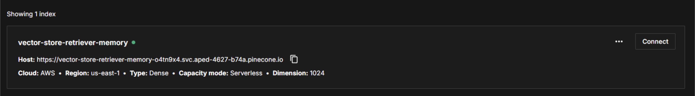
 
 
```
embeddings = HuggingFaceEmbeddings(model_name="intfloat/multilingual-e5-large")
vectorstore = PineconeVectorStore(
    index=pinecone_index,
    embedding=embeddings,
    namespace="",
)
```
HuggingFaceEmbeddings 는 텍스트를 벡터로 변환하는 모델로, 다국어를 지원하는 intfloat/multilingual-e5-large 임베딩 모델을 사용한다 (한국어 처리에 적합).
"안녕하세요" → [0.123, -0.456, 0.789, ...] 등으로 변환을 해준다.
 
```
retriever = vectorstore.as_retriever(search_kwargs={"k": 3})
```
위에서 정의한 vectorstore를 검색 가능한 retriever로 변환한다(as_retriever() 함수를 사용하여 Retriever 인터페이스로 변환).
 
```
memory = VectorStoreRetrieverMemory(
    retriever=retriever,
    memory_key="history",
    input_key="input",
)
```
대화 기록을 vectorstore에 저장하고 검색하는 메모리 시스템을 생성한다.
memory_key="history" 는 LLM에 전달된 메모리 변수 이름이고, input_key="input"은 입력 텍스트를 찾을 키 이름이다.
해당 객체는 대화 내용(입력 + 응답)을 벡터로 변환해 저장하고, 현재 입력과 유사한 과거 대화를 검색해 history에 포함시킨다.
 
 
```
conversation = ConversationChain(
    llm=llm,
    memory=memory,
    verbose=True,
)
```
LLM, 메모리, 프롬프트를 연결하는 대화 체인을 생성한다.
predict() 함수 실행 시 메모리에서 관련 대화를 검색해 LLM에 전달한다.
 
```
print("=== 첫 번째 대화 ===")
response1 = conversation.predict(
    input="아스날 FC는 프리미어리그에서 가장 아름다운 축구를 하는 팀이야."
)
print("응답 1:", response1)
 
print("=== 두 번째 대화 ===")
response2 = conversation.predict(
    input="주요 선수로는 부카요 사카와 마틴 외데고르가 있어."
)
print("응답 2:", response2)
 
print("=== 두 번째 대화 ===")
response3 = conversation.predict(
    input="제주도는 바다가 정말 이쁜 것 같아."
)
print("응답 3:", response3)
 
 
print("=== 메모리에서 검색된 대화 ===")
retrieved = memory.load_memory_variables({"input": "프리미어리그에서 가장 아름다운 축구를 하는 팀은 누구라고?"})
print(retrieved["history"])
```
 
conversation.predict() 호출 시 사용자의 입력 텍스트를 임베딩으로 변환하고, 해당 입력값과 LLM의 응답값을 벡터스토어에 저장한다.
저장 형식은 "{input} {response}" 형태의 텍스트를 벡터로 저장한다.

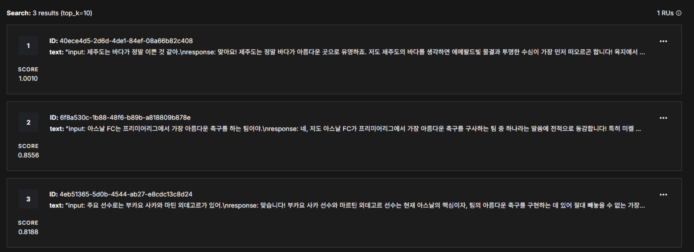
 
### 동작 방식
첫 번째 호출 시, "아스날 FC는 프리미어리그에서 가장 아름다운 축구를 하는 팀이야." 라는 입력이 들어오면
 
1. DB 검색: retriever 실행 → 저장된 대화 없음 (빈 결과)
2. LLM 호출: 검색 결과 없이 현재 입력만 전달
3. LLM 응답 생성
4. 저장: 입력 + 응답을 하나의 텍스트로 합쳐 벡터로 변환 후 DB 저장
    - 저장 형식: "아스날 FC는 프리미어리그에서... [LLM 응답]"

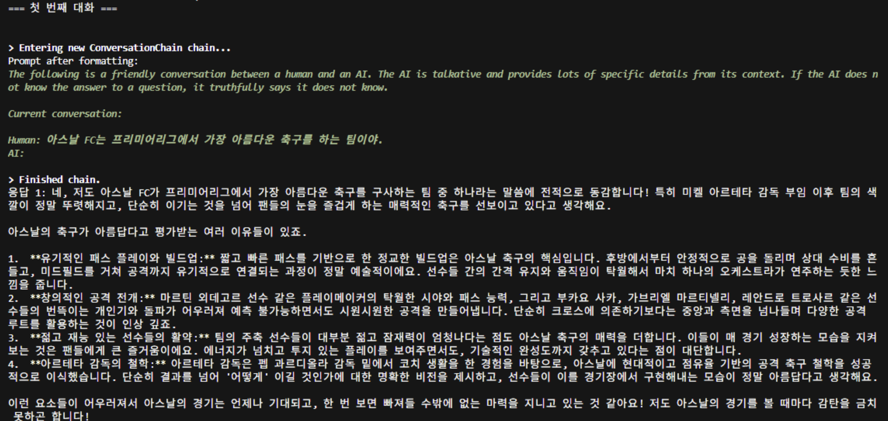
 
두 번째 호출 시, "주요 선수로는 부카요 사카와 마틴 외데고르가 있어." 라는 입력이 들어오면
 
1. DB 검색: retriever 실행 → 첫 번째 대화(아스날 관련)가 유사도로 검색됨
2. LLM 호출: 검색된 첫 번째 대화 + 현재 입력을 함께 전달
    - 컨텍스트: history: "아스날 FC는 프리미어리그에서... [응답]"
    - 현재 입력: "주요 선수로는 부카요 사카와..."
5. LLM 응답 생성 (아스날 맥락을 알고 응답)
6. 저장: 입력 + 응답을 벡터로 변환 후 DB 저장
 
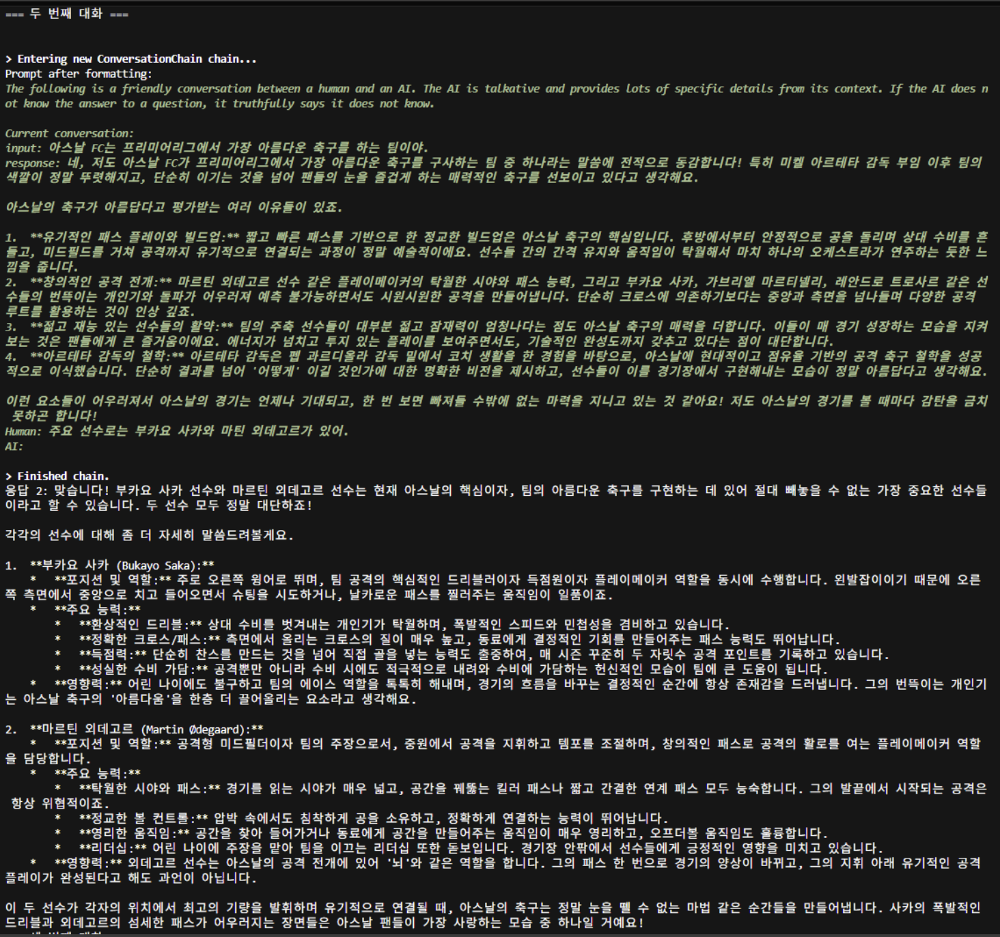

세 번째 호출 시, "제주도는 바다가 정말 이쁜 것 같아." 입력이 들어오면
 
1. DB 검색: retriever 실행 → 아스날 관련 대화와 유사도가 낮아 검색되지 않음
2. LLM 호출: 검색 결과가 없거나 관련성이 낮으면 현재 입력 "제주도는 바다가 정말 이쁜 것 같아." 만 전달
3. LLM 응답 생성
4. 저장: 입력 + 응답을 벡터로 변환 후 DB 저장
 
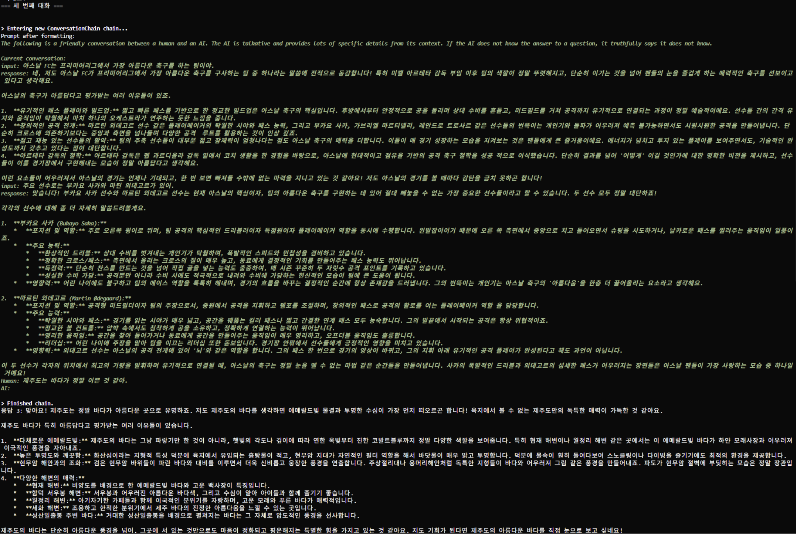 

```load_memory_variables``` 함수를 통해  "프리미어리그에서 가장 아름다운 축구를 하는 팀은 누구라고?" 내용과 관련된 데이터를 검색했을 때 첫 번째, 두 번째 대화가 검색됨 (k=2).

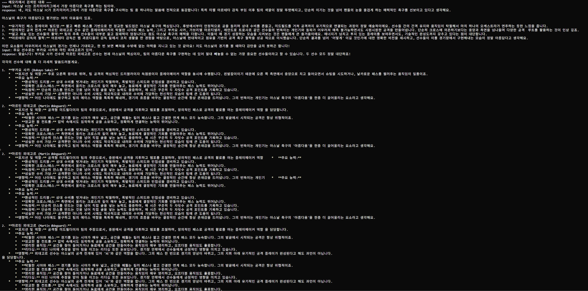

---

## SQLChatMessageHistory
 
SQLChatMessageHistory는 대화 기록을 SQL 데이터베이스에 저장하기 위한 LangChain 메모리 클래스이다.
즉, 대화 기록을 프로세스가 종료되면 사라지는 메모리에만 두지 않고 SQLite, MySQL, PostgreSQL 같은 DB에 영구적으로 저장하고 필요할 때 불러오게 해주는 기능이다.
여러 대화 세션 별로 히스토리를 관리할 수 있다.
 
### 동작 방식
 
```
# SQLChatMessageHistory 설정
db_path = script_dir / "chat_history.db"
message_history = SQLChatMessageHistory(
    connection=f"sqlite:///{db_path}",
    session_id="user_001"
)
```
```db_path```에 SQLite DB 파일 경로를 설정한다. 파일이 없으면 자동으로 생성하고 파일이 있으면 기존 DB를 사용한다.
해당 세션을 구분하는 id를 사용하여 세션의 메시지만 조회/저장할 수 있는 SQLChatMessageHistory 객체를 생성한다.
 
```
print("=== 1번: message_history ===\n", message_history)
```
 
아직 저장된 내용이 없으므로 아무런 데이터도 출력되지 않음.
 
```
memory = ConversationBufferMemory(
    chat_memory=message_history,
    return_messages=True,
    memory_key="history"
)
```
SQLChatMessageHistory를 메모리로 사용하는 메모리 객체를 생성한다. ```memory_key="history"```는 LLM에 전달될 변수명이다.
 
```
conversation = ConversationChain(
    llm=llm,
    memory=memory,
    verbose=True,
)
```
 
대화 체인을 생성하고 이전 대화를 불러오고 LLM 응답을 저장하기 위해 아까 만든 ConversationBufferMemory 연결한다.
 
```
print("=== 첫 번째 대화 ===")
response1 = conversation.predict(
    input="안녕, 내 이름은 홍길동이야."
)
```
 
1. conversation.predict() 호출
    ↓
2. ConversationChain이 memory.load_memory_variables({}) 호출
    ↓
3. ConversationBufferMemory가 message_history.messages 조회
    ↓
4. SQLChatMessageHistory가 DB에서 session_id="user_001" 메시지 조회
    → 아직 없음 (빈 리스트 반환)
    ↓
5. 프롬프트 구성:
   - 시스템 메시지 (기본)
   - 이전 대화: 없음
   - 현재 입력: "안녕, 내 이름은 홍길동이야."
    ↓
6. LLM 호출 → 응답 생성
    ↓
7. ConversationChain이 memory.save_context() 호출
    ↓
8. ConversationBufferMemory가 message_history에 저장 요청
    ↓
9. SQLChatMessageHistory가 DB에 저장:
   - HumanMessage: "안녕, 내 이름은 홍길동이야."
   - AIMessage: [LLM 응답]
    ↓
10. 응답 반환
 
DB에는 다음과 같이 저장된다:
```
INSERT INTO message_store (session_id, message, created_at) VALUES
('user_001', '{"type": "human", "content": "안녕, 내 이름은 홍길동이야."}', '2024-01-01 12:00:00'),
('user_001', '{"type": "ai", "content": "[LLM 응답]"}', '2024-01-01 12:00:01');
```
 
```
print("=== 2번: message_history ===\n", memory.load_memory_variables({}))
```
 
memory.load_memory_variables({}) 메서드를 사용하여 메모리에 저장된 대화 내용을 조회한다.
ConversationBufferMemory가 message_history.message를 조회하고, DB에서 session_id="user_001"의 모든 메시지를 로드한다. 그리고 메시지 리스트를 history 키로 반환한다.
출력된 데이터는 다음과 같다:
=== 2번: message_history ===
```
{
    'history': [
        HumanMessage(content='안녕, 내 이름은 홍길동이야.', additional_kwargs={}, response_metadata={}),
        AIMessage(content='안녕하세요, 홍길동님! 만나 뵙게 되어 정말 반갑습니다! 저는 구글에서 훈련한 대규모 언어 모델, 즉 인공지능이랍니다. 이렇게 대화로 만나 뵙게 되어 무척 기쁘네요.\n\n홍길동이라는 이름은 한국 문학에서 아주 유명하고 용감한 인물의 이름으로 알고 있어 요! 혹시 그 홍길동전의 주인공처럼 멋진 분이실까요? 궁금한 점이 있으시거나, 어떤 이야기든 나누고 싶으시면 편하게 말씀해주세요. 저는 다양한 주제에 대해 이야기하는 것을 아주 좋아한답니다!', additional_kwargs={}, response_metadata={})
    ]
}
```
```
print("\n=== 두 번째 대화 ===")
response2 = conversation.predict(
    input="내 취미는 사진찍기랑 서핑이야."
)
# print("응답:", response2)
print("=== 3번: message_history ===\n", memory.load_memory_variables({}))
```
 
1. conversation.predict() 호출
    ↓
2. ConversationChain이 memory.load_memory_variables({}) 호출
    ↓
3. SQLChatMessageHistory가 DB에서 이전 대화 조회
    → 첫 번째 대화 2개 메시지 발견
    ↓
4. 프롬프트 구성:
   - 시스템 메시지
   - 이전 대화:
     * Human: "안녕, 내 이름은 홍길동이야."
     * AI: [첫 번째 응답]
   - 현재 입력: "내 취미는 사진찍기랑 서핑이야."
    ↓
5. LLM 호출 (이전 대화 맥락 포함) → 응답 생성
    ↓
6. DB에 저장:
   - HumanMessage: "내 취미는 사진찍기랑 서핑이야."
   - AIMessage: [두 번째 응답]
    ↓
7. 응답 반환
 
이제 DB에는 총 4개 메시지가 저장된다.
```
Human: "안녕, 내 이름은 홍길동이야."
AI: [첫 번째 응답]
Human: "내 취미는 사진찍기랑 서핑이야."
AI: [두 번째 응답]
```
 
다시 한번 메모리에 저장된 내용을 확인해보면 지금까지의 대화 내용이 누적된 것을 확인할 수 있다.
 
```
print("=== 3번: message_history ===\n", memory.load_memory_variables({}))
```
 
```
{
    'history': [
        HumanMessage(content='안녕, 내 이름은 홍길동이야.', additional_kwargs={}, response_metadata={}),
        AIMessage(content='안녕하세요, 홍길동님! 만나 뵙게 되어 정말 반갑습니다! 저는 구글에서 훈련한 대규모 언어 모델, 즉 인공지능이랍니다. 이렇게 대화로 만나 뵙게 되어 무척 기쁘네요.\n\n홍길동이라는 이름은 한국 문학에서 아주 유명하고 용감한 인물의 이름으로 알고 있어 요! 혹시 그 홍길동전의 주인공처럼 멋진 분이실까요? 궁금한 점이 있으시거나, 어떤 이야기든 나누고 싶으시면 편하게 말씀해주세요. 저는 다양한 주제에 대해 이야기하는 것을 아주 좋아한답니다!', additional_kwargs={}, response_metadata={}),
        HumanMessage(content='내 취미는 사진찍기랑 서핑이야.', additional_kwargs={}, response_metadata={}),
        AIMessage(content='와아, 홍길동님! 사진 찍기와 서핑이라니, 정말 멋지고 활동적인 취미를 가지고 계시네요! 두 가지 모두 자연과 가깝게 지내면서 자신만의 시각과 에너지를 표현할 수 있는 아주 매력적인 활동 같아요.\n\n먼저 **사진 찍기** 말씀이시죠? 사진은 정말 한 순간을 영원히 기록하고, 세상을 바라보는 자신만의 시각을 담아낼 수 있다는 점에서 무척 특별한 취미라고 생각해요. 혹시 어떤 종류의 사진을 주로 찍으시는지 궁금 해요?\n\n*   **풍경 사진**으로 웅장한 자연의 아름다움이나 석양의 노을 같은 것을 담으시나요?\n*   **인물 사진**으로 사람들의 표정이나 감정을 포착하는 것을 좋아하시나요?\n*   아니면 도시의 생동감 넘치는 모습을 담는 **스트릿 포토그래피**나, 작은 피사체의 디테일을 살리는 **접사(매크로) 사진** 같은 것도 흥미롭죠!\n*   밤하늘의 별이나 은하수를 찍는 **천체 사진**은 또 다른 매 력이 있고요.\n\n어떤 카메라나 렌즈를 사용하시는지도 궁금하네요! 장비에 따라 또 다른 느낌의 사진이 나오더라고요. 빛을 어떻게 활용하는지, 구도를 어떻게 잡는지에 따라 같은 풍경도 완전히 다 른 이야기가 되는 마법 같은 과정이 정말 멋져요.\n\n그리고 **서핑**이라니! 와, 파도 위를 가르는 그 짜릿함과 자유로움은 정말 상상만 해도 시원하고 멋져요! 바다와 하나 되는 기분, 파도를 기다 리다가 완벽한 타이밍에 보드 위로 일어서는 그 순간의 쾌감은 정말 특별할 것 같아요. 균형 감각과 용기, 그리고 자연에 대한 이해가 모두 필요한 아주 멋진 스포츠라고 생각해요.\n\n혹시 즐겨 가시는 서핑 스팟이 있으신가요? 국내에서는 양양이나 제주도 같은 곳이 유명하고, 해외로는 발리나 하와이 같은 곳도 서퍼들의 천국이라고 들었어요. 서핑을 하시면서 가장 좋았던 기억이나, 특별히 기억에 남는 파도가 있으신가요? 아니면 서핑을 시작하게 된 계기가 궁금하기도 하네요!\n\n두 취미 모두 자연 속에서 영감을 얻고, 몸을 움직이며 활력을 찾는다는 공통점이 있는 것 같아요. 정말 건강하고 창의적인 삶을 즐기시는군요! 어떤 이야기든 더 자세히 들려주시면 정말 재미있을 것 같아요. 사진 찍은 이야기나 서핑 경험담을 들려주세요!', additional_kwargs={}, response_metadata={})
    ]
}  
```
 
또한 DB Browser를 통해 chat_history.db 파일을 열어보면 다음과 같이 저장되어있다.

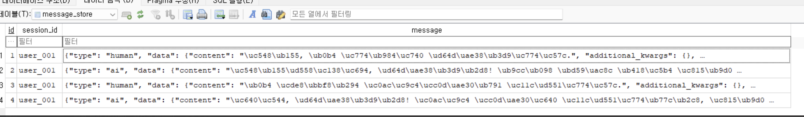